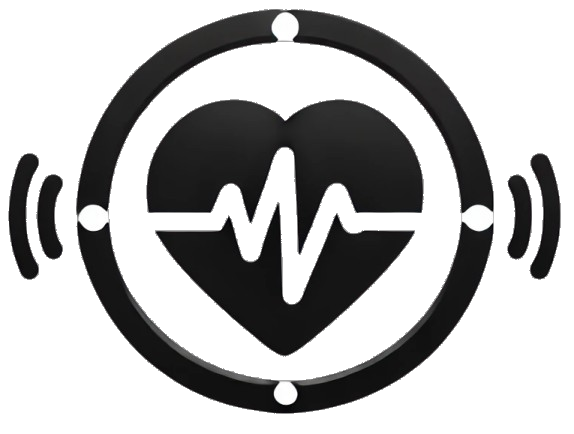
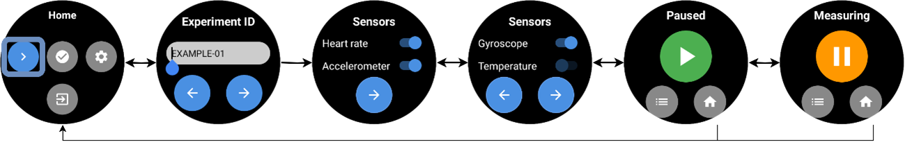
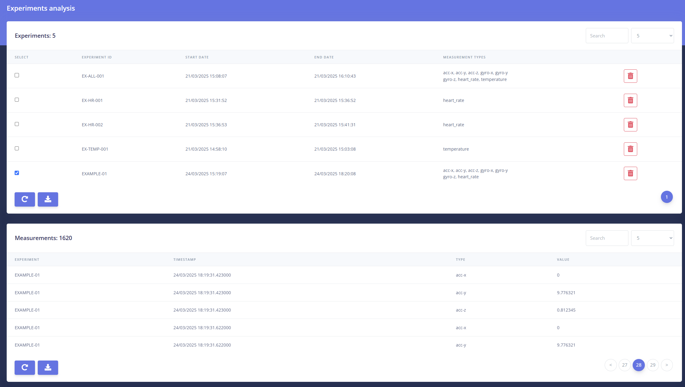

# SmartBioStream

<p align="center">
  
</p>

## Description

SmartBioStream is a Wear OS application that enables the collection of biometric data through affordable, user-friendly smartwatches. In addition, we provide a web platform, ServerBioStream, to receive, store, and download the data sent by the smartwatches. The combination of both applications supports conducting biometric studies without needing expensive and sophisticated research-oriented devices. SmartBioStream can also transmit biometrics to other systems for their analysis, such as educational and workplace platforms. The flexibility, ease of use, and cost-effectiveness of both applications make them valuable tools for democratizing biometric data collection and analysis.

## Features
### SmartBioStream
SmartBioStream is a Wear OS application that enables the collection of biometric data through affordable, user-friendly smartwatches. In addition, we provide a web platform, ServerBioStream, to receive, store, and download the data sent by the smartwatches. The combination of both applications supports conducting biometric studies without needing expensive and sophisticated research-oriented devices. SmartBioStream can also transmit biometrics to other systems for their analysis, such as educational and workplace platforms. 

SmartBioStream' s user interface was designed to be simple and intuitive, especially the views of the end-users. While administrators and researchers may have more experience with the application, end-users, such as case study participants, probably do not. Consequently, we focused on handling complexities within the application code to provide a better user experience. This application integrates three main functionalities:

- **Options**. This functionality enables users to adjust settings related to communication with the server. These settings should be set by researchers or administrators, not by the end-users. This configuration is stored on the smartwatch and remains saved even if the application is closed. The views of this functionality enable the selection of the server's IP address, the port, the protocol (HTTP or HTTPS), whether the application should verify the HTTPS certificate, and the authentication method (username and password or identifier).

- **Connection test**. This view checks the connectivity between the application and the server. Before starting an experiment, a researcher should verify the server's availability. 

- **Data collection**. These views collect and send biometrics from the end-users. Depending on the application settings, this functionality may require an experiment identifier or a username and password. After registration, the users select from the available sensors, including heart rate, accelerometer, gyroscope, and temperature. Then, the users access the recording view, where they can temporarily pause the data collection, return to the sensor menu, or navigate back to the main menu. 


### ServerBioStream

ServerBioStream is a Django web application that receives and stores the data collected from SmartBioStream. We have developed this tool to provide access to the data gathered during the various experiments of a case study. This platform is intended for researchers and administrators rather than the participants of the experiments. Consequently, it provides the following functionalities:

-	**JSON API**. This API receives the data emitted by one or multiple smartwatches. The messages are processed, and each measurement is stored in the SQLite database. The API is developed considering the first use case where the end-users are participants of a case study and only provide their experiment identifier.
 
-	**User management**. ServerBioStream considers two roles: researchers and administrators. Researchers can connect to the platform and download the stored data. Administrators are the only ones who can create new users. Both of them have to authenticate with a username and password before accessing the web platform.  

-	**Data monitoring**. Researchers and administrators can visualize the data received and stored for each experiment. This feature also helps ensure the proper collection of the biometrics during the experiments. It is worth noting that SmartBioStream queues several measurements in the same data transmission, which means that there may be a delay of less than a minute in the data display.

-	**Data export**. The users of this platform can download the data collected from each experiment in CSV, XLSX, and PDF formats. This functionality enables the researchers to develop their specific analyses with the necessary software, such as Excel and Python.


## Installation & Setup
We provide two detailed installation and user manuals for [SmartBioStream](docs/SmartBioStream.md) and [ServerBioStream](docs/ServerBioStream.md).

## Usage

### SmartBioStream
To start data collection, we press the first button in the home menu. In the next view, we need to enter the experiment identifier, which must be provided by a researcher. This identifier will be used to group the data in ServerBioStream. If username and password authentication has been selected in the settings, a login view will appear for entering these credentials. The next view corresponds to data collection. By default, data collection is paused and must be started by pressing the "Play" green button. From this view, you can return to the main menu or change the sensor selection. 


<p align="center">
  
  <br>
</p> 

### ServerBioStream
To access ServerBioStream, start by logging in. The default view presents the login menu. Initially, the system includes a predefined user with the username "admin" and password "admin." Once we are authenticated, we are redirected to the experiments page.  This view displays two tables: the first summarizes all the experiments, and the second shows the collected data for the experiments selected in the first table. In the upper right corner of each table, there is a search bar to filter the table data. Additionally, we can adjust the number of items displayed per page on the table. During and after the experiments, researchers can download the collected data in CSV, XLSX, and PDF formats. The downloaded files can then be analyzed using various data analysis software, such as Python or Excel. It is worth noting that SmartBioStream queues several measurements in the same data transmission, which means that there may be a delay of less than a minute in the data display. We can also delete all the information about an experiment using the trash buttons, for example, if there was an error or if the user requested it.

<p align="center">
  
  <br>
</p>


## Folder Structure

```
SmartBioStream/
│-- docs/            # Documentation files
│-- src/             # Source code
│-- README.md        # This README file
│-- LICENSE.md       # LICENSE file
```


## License

This project is licensed under the MIT License - see the [LICENSE.md](LICENSE.md) file for details.

## Contact & Support

Mariano Albaladejo González
- Email: [mariano.albaladejog@um.es](mariano.albaladejog@um.es)
- LinkedIn: [Mariano Albaladejo González](https://www.linkedin.com/in/mariano-albaladejo-gonzález-8896661b2)
- ORCID: [Mariano Albaladejo González](https://orcid.org/0000-0002-8931-12482)


