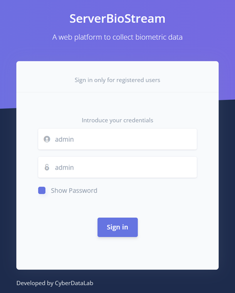
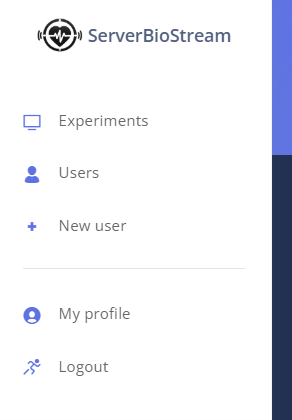
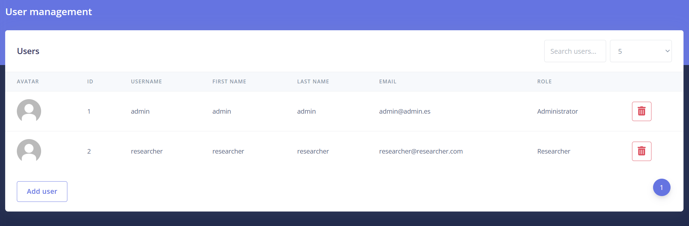
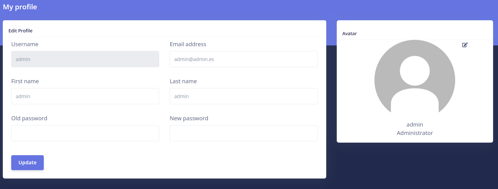
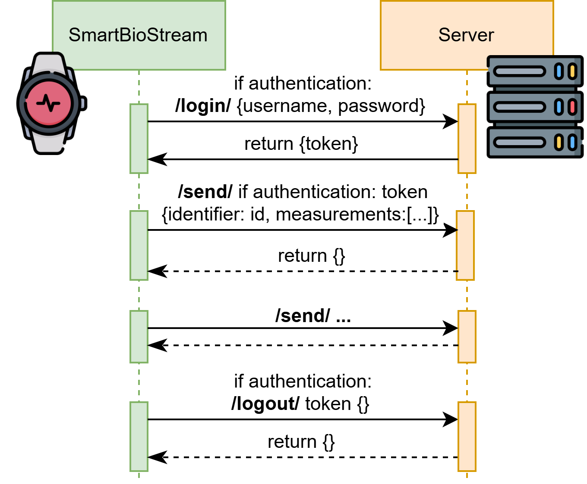

# ServerBioStream

<p align="center">
  
</p>

## Introduction

ServerBioStream is a Django web application that receives and stores the data collected from SmartBioStream. We have developed this tool to provide access to the data gathered during the various experiments of a case study. This platform is intended for researchers and administrators rather than the participants of the experiments. Consequently, it provides the following functionalities:

-	**JSON API**. This API receives the data emitted by one or multiple smartwatches. The messages are processed, and each measurement is stored in the SQLite database. The API is developed considering the first use case where the end-users are participants of a case study and only provide their experiment identifier.
 
-	**User management**. ServerBioStream considers two roles: researchers and administrators. Researchers can connect to the platform and download the stored data. Administrators are the only ones who can create new users. Both of them have to authenticate with a username and password before accessing the web platform.  

-	**Data monitoring**. Researchers and administrators can visualize the data received and stored for each experiment. This feature also helps ensure the proper collection of the biometrics during the experiments. It is worth noting that SmartBioStream queues several measurements in the same data transmission, which means that there may be a delay of less than a minute in the data display.

-	**Data export**. The users of this platform can download the data collected from each experiment in CSV, XLSX, and PDF formats. This functionality enables the researchers to develop their specific analyses with the necessary software, such as Excel and Python.

## Test deployment

The first step to deploy ServerBioStream is to install Python [[1]](https://www.python.org/downloads/) and the required dependencies. We provide a requirements file to facilitate the installation of the Python libraries used by ServerBioStream. Therefore, it is only necessary to run the following command in the project folder:

```bash
pip install -r requirements.txt
```

Once the installation is finished, we can deploy ServerBioStream using the command: 

```bash
python manage.py runserver ip_address:port    
```

By default, the IP address should be the IP of the machine where ServerBioStream is running [[2]](https://www.avg.com/en/signal/find-ip-address). For the port, we recommend using 8000 for HTTP connections and 8080 for HTTPS.

On Windows, the machine's IP address can be obtained by opening a terminal, running the command `ipconfig`, and looking for the IPv4 address under the active connection (Wi-Fi or Ethernet). Alternatively, it can be found visually in the "Control Panel." On Ubuntu, the IP address can be retrieved by opening a terminal and running `ifconfig`, then checking the IP associated with `eth0 (wired connection)` or `wlan0 (Wi-Fi)`. It can also be found through the "Settings" menu under "Network". On MacOS, the IP address can be obtained by opening a terminal, running `ifconfig`, and looking for the IP under `en0 (Wi-Fi)` or `en1 (Ethernet)`. It is also possible to visualize the IP graphically by going to "System Settings," selecting "Network," and choosing the active connection.

Finally, we can access ServerBioStream through a web browser using the URL `http://ip_address:port`. By default, the login menu will be displayed (Figure 1). The default database includes a user with the username "admin" and password "admin." We strongly recommend changing this password for security reasons.


<p align="center">
  
  <br>
  <em>Figure 1. Login menu of ServerBioStream</em>
</p>


##	HTTPS
There are two ways to use HTTPS in ServerBioStream: utilizing the Django extension PyOpenSSL or incorporating a NGINX. By default, ServerBioStream is deployed in HTTP to facilitate users without advanced computer science skills to utilize it.  The first common step is to get or create the certificates. We can create a self-signed certificate for test purpose using OpenSSL [[3]](https://www.openssl.org/): 

- Ubuntu: `sudo apt install openssl`
- MacOS: `brew install openssl`
- Windows: Install Chocolatey [[4]](https://chocolatey.org/install), and then running in a terminal:
`choco install openssl -y`

Once SSL is installed, we can create the certificates through the command: 

```bash
openssl req -x509 -newkey rsa:4096 -keyout key.pem -out cert.pem -days 365 -nodes
```

For production use, we recommend obtaining certificates from a valid Certificate Authority (CA). If using certificates from an unrecognized CA, we must enable the HTTPS option in SmartBIoStream and disable CA verification.

### PyOpenSSL
PyOpenSSL is a Python wrapper module around the OpenSSL library, which provides a high-level interface for SSL and TLS (Transport Layer Security) in Python applications. We start installing the required python dependencies:

```bash
pip install werkzeug

pip install django-extensions

pip install pyOpenSSL
```

After that, in ServerBioStream/settings.py, we need to add "django_extensions" to the installed apps:

```python
INSTALLED_APPS = [ 
    'django.contrib.admin',
    'django.contrib.auth',
    'django.contrib.contenttypes',
    'django.contrib.sessions',
    'django.contrib.messages',
    'django.contrib.staticfiles',
    'apps.viewData',
    'apps.authentication',
    'apps.users',
    'apps.dataAPI',
    'django_extensions'
]
```


In ServerBioStream folder, we can run Django's development server with this configuration to use an SSL certificate:

```bash
python manage.py runserver_plus --cert-file ROUTE_TO_CERTS/cert.pem --key-file ROUTE_TO_CERTS /key.pem YOUR_IP:8080`
```

## NGINX
Users can deploy NGINX to secure communications with ServerBioStream. We can download and install NGINX from the official website [[5]](https://nginx.org/en/download.html
). Then, we need to edit the NGINX configuration file. This file is located at:

-	Windows: `C:\nginx\conf\nginx.conf`
-	Ubuntu: `/etc/nginx/sites-available/default`
-	MacOS: `/usr/local/etc/nginx/nginx.conf`

```python
server {
    listen 8080 ssl;

    ssl_certificate  ROUTE_TO_CERT_FILE;
    ssl_certificate_key ROUTE_TO_KEY_FILE;

    location / {
        proxy_pass http://localhost:8000;
        proxy_http_version 1.1;
        proxy_set_header Upgrade $http_upgrade;
        proxy_set_header Connection 'upgrade';
        proxy_set_header Host $host;
        proxy_cache_bypass $http_upgrade;
    }
}
```

This NGINX configuration file enables HTTPS and uses the previously generated certificates. It redirects HTTPS requests from port 8080 to port 8000. Later, we will deploy ServerBioStream at `http://localhost:8000`, and it will respond to the redirected requests. The next step is to check for errors in the NGINX configuration:

```bash
nginx -t
```

And restart NGINX: 

```bash
nginx -s reload
```

Finally, we deploy ServerBioStream at `localhost:8000`

```bash
python manage.py runserver localhost:8000
```

## PostgreSQL
By default, ServerBioStream uses an SQLite database. This database is easier to install, especially for users without a background in computer science. However, to improve the performance of ServerBioStream, particularly for handling multiple concurrent experiments, we recommend using a PostgreSQL database [[6]](https://www.w3schools.com/postgresql/index.php ).

Once we have a PostgreSQL database set up, we need to install the Psycopg2 package:

```bash
pip install psycopg2
```

Then, we change the database configuration (`DATABASES`) in ServerBioStream/settings.py to:

```python
DATABASES = {
    'default': {
        'ENGINE': 'django.db.backends.postgresql'
        'NAME': 'NAME_OF_DB',
        'USER': 'DB_USER_NAME',
        'PASSWORD': 'DB_PASSWORD',
        'HOST': 'localhost',
        'PORT': 'PORT_NUMBER',
    }
}
```

We apply the migrations: 

```bash
python manage.py makemigrations
python manage.py migrate
```

Finally, we create a user for the new database: 

```bash
python manage.py createUser "name" "surname" "username" "email" "password" "password"
```

## User manual
To access ServerBioStream, start by logging in. The default view presents the login menu. Initially, the system includes a predefined user with the username "admin" and password "admin." Once we are authenticated, we are redirected to the experiments page (Figure 2). This view displays two tables: the first summarizes all the experiments, and the second shows the collected data for the experiments selected in the first table. In the upper right corner of each table, there is a search bar to filter the table data. Additionally, we can adjust the number of items displayed per page in each table. During and after the experiments, researchers can download the collected data in CSV, XLSX, and PDF formats. The downloaded files can then be analyzed using various data analysis software, such as Python or Excel. It is worth noting that SmartBioStream queues several measurements in the same data transmission, which means there may be a delay of less than a minute in the data display. We can also delete all the information about an experiment using the trash buttons, for example, if there was an error or if the user requested it.

<p align="center">
  
  <br>
  <em>Figure 2. Experiments analysis view</em>
</p>


The left navigation bar (Figure 3) allows users to navigate to other menus. Any user can update their profile, while administrator users can view all users and create new ones.

<p align="center">
  
  <br>
  <em>Figure 3. Navigation bar of an administrator user</em>
</p>


As Figure 4 illustrates, the user management menu provides a list of all ServerBioStream users. In this view, we can visualize user information and also delete users. It is worth mentioning that participants in a case study should not have an account on ServerBioStream; only researchers and administrators should use it.
 
<p align="center">
  
  <br>
  <em>Figure 4. User management, restricted to administrators</em>
</p>


Figure 5 shows a user profile, which includes a unique username, an email address, a first name, a last name, and an avatar that can be changed to any image. Additionally, user accounts have a password, which can be changed by the user. The view for creating a new user is similar, with the key distinction that the user's role (researcher or administrator) must be specified. Initially, administrators create a password for user profiles, and after logging in, users can change their passwords.
 
 <p align="center">
  
  <br>
  <em>Figure 5. User profile</em>
</p>


## Developing your own server

SmartBioStream can communicate with and send biometric data to any other application that uses the API we have designed. ServerBioStream is an example where user authentication is not required, but SmartBioStream supports login using a username and password. The server should provide an endpoint to send the measurement, and two more for login and logout if required. The endpoints should be `/measurements-api/login/,` `/measurements-api/send/,` and `/measurements-api/logout/`. Nevertheless, these endpoints can be modified in SmartBioStream by updating the files Login.kt, Logout.kt, and DataSend.kt.

SmartBioStream transmits the collected data in JSON format to the specified server. The JSON structure used to send the measurements is described below:


```JSON
{
 "identifier": "experiment_id_or_username",
  "measurements": [
    {
      "date": "UNIX_timestamp",
      "type": "type_data_such_as_heart_rate",
      "value": "value_collected"
    }
    ...
  ]
}
```

If the user authentication option is enabled, two additional messages are sent: one for login and another for logout. These messages are especially valuable when using SmartBioStream within organizations that have user profiles. First, SmartBioStream sends the username and password entered by the user to the server's login endpoint (URL) in JSON format. The server should respond with an authentication token, which will be included in the token header of all subsequent data sent. Finally, providing the authentication token, SmartBioStream connects to the logout endpoint to expire the token. The communication between SmartBioStream and the server is summarized in Figure 6.

 <p align="center">
  
  <br>
  <em>Figure 6. Summary of the communication between SmartBioStream and a server</em>
</p>
