# SmartBioStream

  

## Introduction

SmartBioStream is a Wear OS application that enables the collection of biometric data through affordable, user-friendly smartwatches. In addition, we provide a web platform, ServerBioStream, to receive, store, and download the data sent by the smartwatches. The combination of both applications supports conducting biometric studies without needing expensive and sophisticated research-oriented devices. SmartBioStream can also transmit biometrics to other systems for their analysis, such as educational and workplace platforms. 
SmartBioStream' s user interface was designed to be simple and intuitive, especially the views of the end-users. While administrators and researchers may have more experience with the application, end-users, such as case study participants, probably do not. Consequently, we focused on handling complexities within the application code to provide a better user experience. This application integrates three main functionalities:

- **Options**. This functionality enables users to adjust settings related to communication with the server. These settings should be set by researchers or administrators, not by the end-users. This configuration is stored on the smartwatch and remains saved even if the application is closed. The views of this functionality enable the selection of the server's IP address, the port, the protocol (HTTP or HTTPS), whether the application should verify the HTTPS certificate, and the authentication method (username and password or identifier).

- **Connection test**. This view checks the connectivity between the application and the server. Before starting an experiment, a researcher should verify the server's availability. 

- **Data collection**. These views collect and send biometrics from the end-users. Depending on the application settings, this functionality may require an experiment identifier or a username and password. After registration, the users select from the available sensors, including heart rate, accelerometer, gyroscope, and temperature. Then, the users access the recording view, where they can temporarily pause the data collection, return to the sensor menu, or navigate back to the main menu. 

## Android Studio

The first step to deploy SmartBioStream is installing Android Studio. Android Studio is an integrated development environment (IDE) designed for creating Android applications, including those for Wear OS smartwatches. Using this IDE, we can install SmartBioStream on a smartwatch or run it in an emulator for testing.

To download Android Studio, we visit the official website [[1]](https://developer.android.com/studio). Android Studio is available for Linux, MacOS, and Windows operating systems. We recommend choosing the standard installation, during the installation we must accept the license agreements and terms of use.

Once the IDE is installed, we launch Android Studio for the first time. In the welcome menu, we select "Open," navigate to the decompressed SmartBioStream folder, and open the application file (the SmartBioStream file with the green Android logo), as illustrated in Figure 1.

  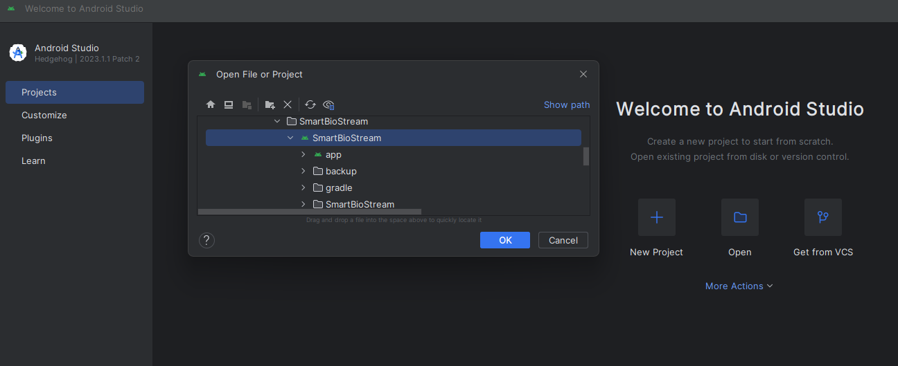
   
  <em>Figure 1. Import the SmartBioStream project in Android Studio</em>

After importing the project, we would need to wait until all the configuration files are loaded (Figure 2). 

  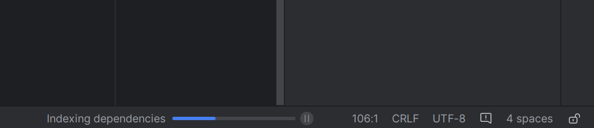
   
  <em>Figure 2. Progress bar indicating the import of a project in Android Studio</em>

Figure 3 displays the project view, it is important to verify the "play" button is in green. 

  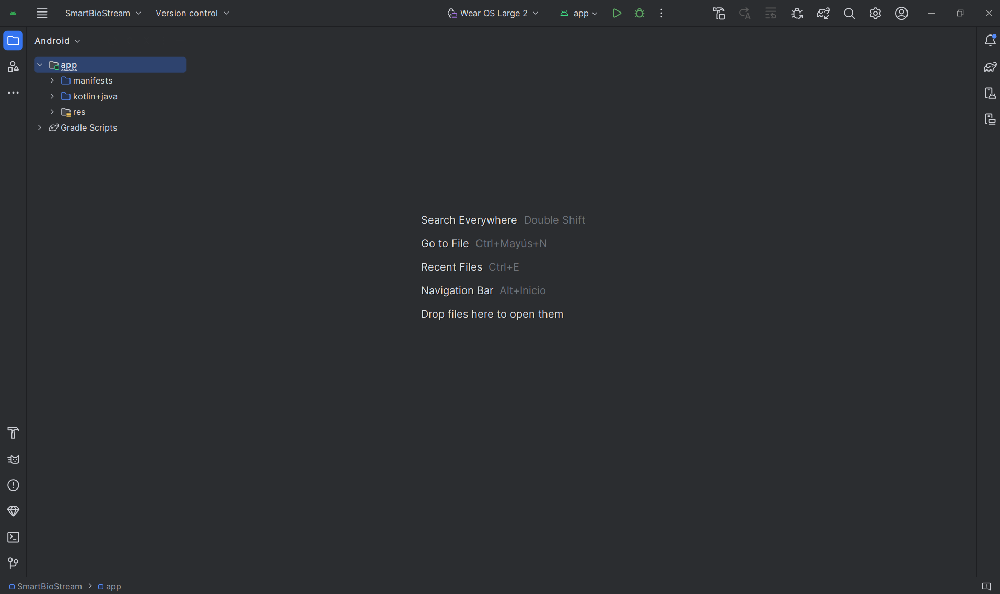
   
  <em>Figure 3. Project menu in Android Studio</em>

## Test SmartBioStream in an emulator
In this section, we explain how to utilize SmartBioStream with the emulators available in Android Studio. Additionally, there are official tutorials available in [[2]](https://developer.android.com/studio/run/managing-avds) and [[3]](https://developer.android.com/training/wearables/get-started/creating). Starting from the project view, we open the Device Manager menu by clicking the third button in the right panel (Figure 4). Then, we select the "+" button to add a new emulator, and we click on "Create Virtual Device."

  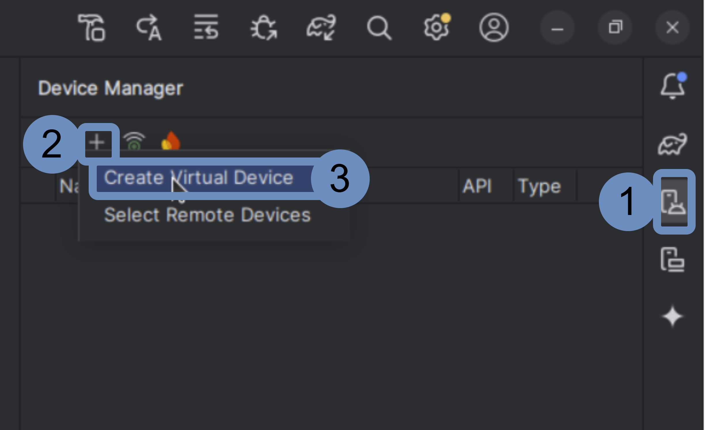
   
  <em>Figure 4. Accessing the creation of a smartwatch emulator in Android Studio</em>

Next, we will create a smartwatch emulator. To do this, in the menu shown in Figure 5, we select "Wear OS." Within this category, we choose "Wear OS Small Round." After clicking the "Next" button, we need to select an operating system image. We recommend using the "Android 13 Tiramisu" version. Before selecting it, we must first download the image by clicking the download icon next to the desired version. 

  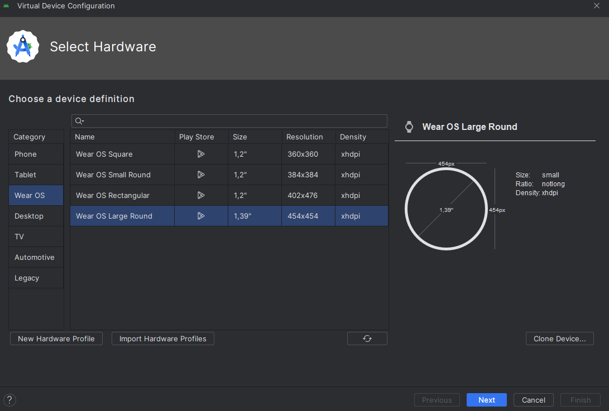
   
  <em>Figure 5. Device configuration for the smartwatch emulator</em>

 

 Once the download is complete, we can proceed with the selection of the operating system image. This process is depicted in Figure 6. In the next window, no additional configuration changes are needed; we simply click the "Finish" button.

  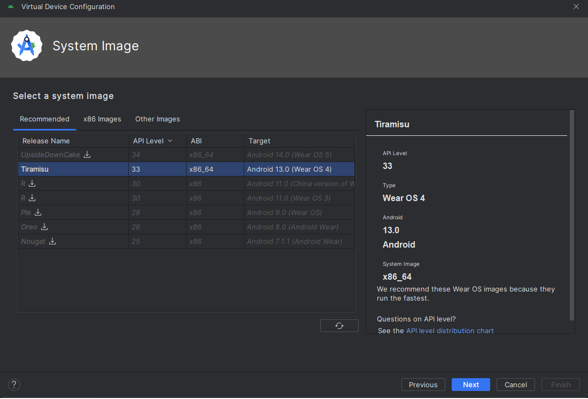
   
  <em>Figure 6. System image configuration for the smartwatch emulator</em>

 

Figure 7 shows the newly added device in the Device Manager. Finally, we click the "Start" button, which automatically opens the Running Devices window and displays the smartwatch, as shown in Figure 8.

  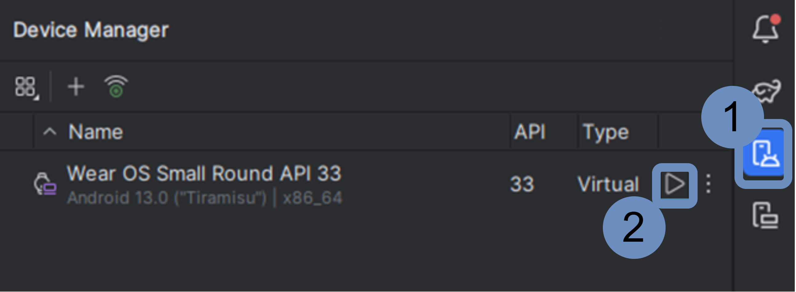
   
  <em>Figure 7. Launching an emulator through Device Manager</em>

 
 

  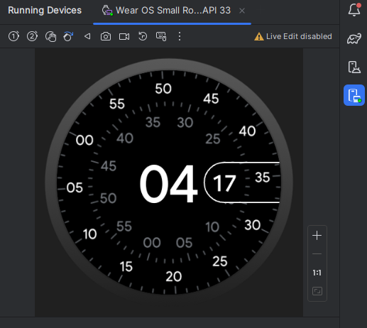
   
  <em>Figure 8. Emulator without an application in the Running Devices window</em>

 
  

Once the emulator is running, we click the "play" button in the upper menu, and SmartBioStream will be launched on the emulator, as Figure 9 depicts. 

  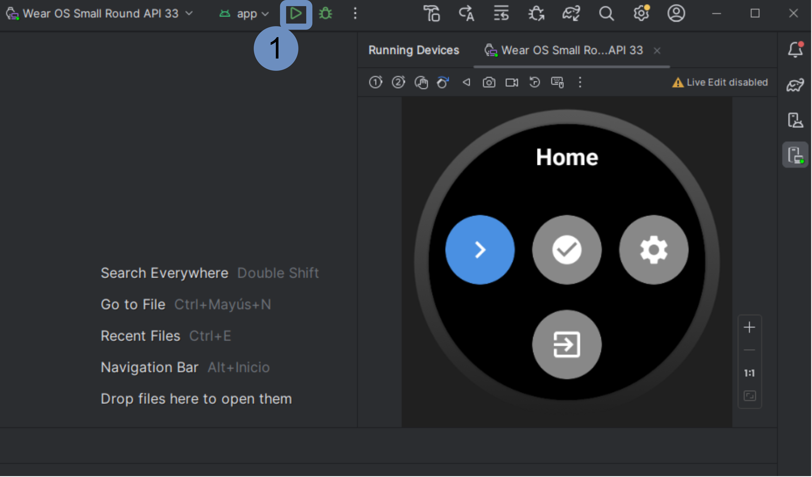
   
  <em>Figure 9. Running SmartBioStream on the smartwatch emulator </em>

 
   
Finally, we adjust the values of the emulated smartwatch sensors through the "Extended Controls" button, as Figure 10 illustrates. It is worth noting that some sensors do not work if they are not adjusted from their default values, especially the temperature and heart rate sensors. Furthermore, there are some bugs in the emulators that sometimes cause the set values to be ignored. We recommend avoiding the use of mouse scrolling, as there is a bug in the emulators that can cause them to crash. Emulating the latest version of Wear OS may trigger bug messages such as "Clock keeps stopping." Users can choose to close the application, as these issues are unrelated to SmartBioStream. Nevertheless, we recommend using "Android 13 Tiramisu," as indicated in Figure 6, to avoid this issue

  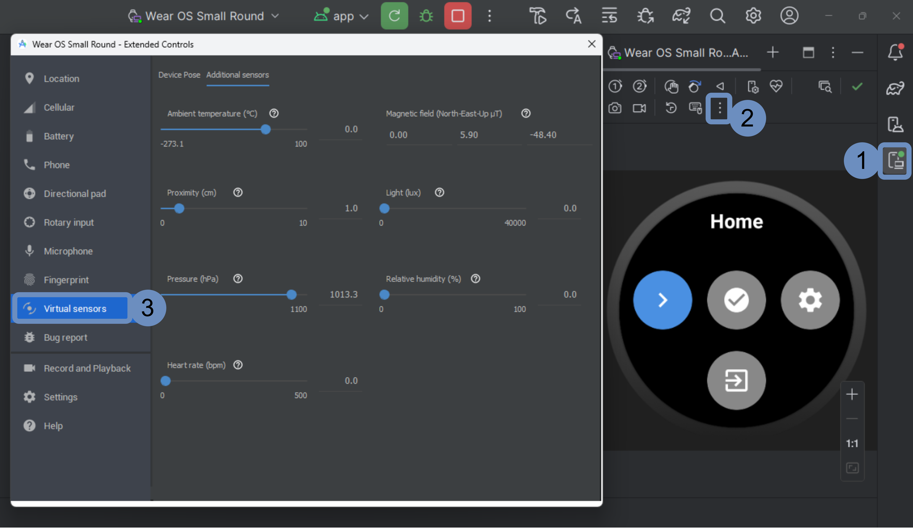
   
  <em>Figure 10. Setting the values of the smartwatch sensors </em>

 

## Lauch SmartBioStream on a smartwatch
This section explains how to launch SmartBioStream on a Wear OS smartwatch. More details are available in [[3]](https://developer.android.com/training/wearables/get-started/creating). Before transferring the application, the smartwatch and the computer on which Android Studio is running must be connected to the same Wi-Fi network. For this section, we have used a Samsung Galaxy Watch 6 as an example, but the steps are similar for other smartwatches with Wear OS.

### Activate developer mode on Wear OS
To activate developer mode, we must access the Wear OS settings menu. This menu can be accessed in different ways, for example, through the application list menu or the quick access menu (accessible by swiping up or down from the watch face). From the settings menu, we must navigate to "About watch," then to "Software information," and tap three times on "Software version." At this point, developer mode has been activated. Figure 11 summarizes this process.

  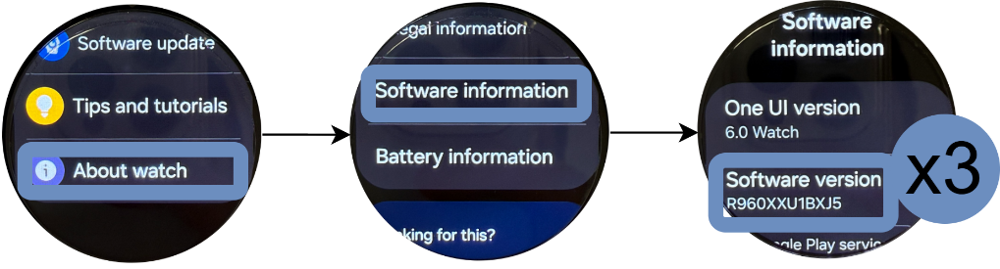
   
  <em>Figure 11. Enable the developer mode on Wear OS </em>

 

### Send SmartBioStream to a smartwatch
To send the application to the smartwatch, we need to return to the settings menu. From there, we navigate to the newly available "Developer options" and enable "ADB debugging." Next, we enter "Wireless debugging" and confirm the prompt, as shown in Figure 12.

  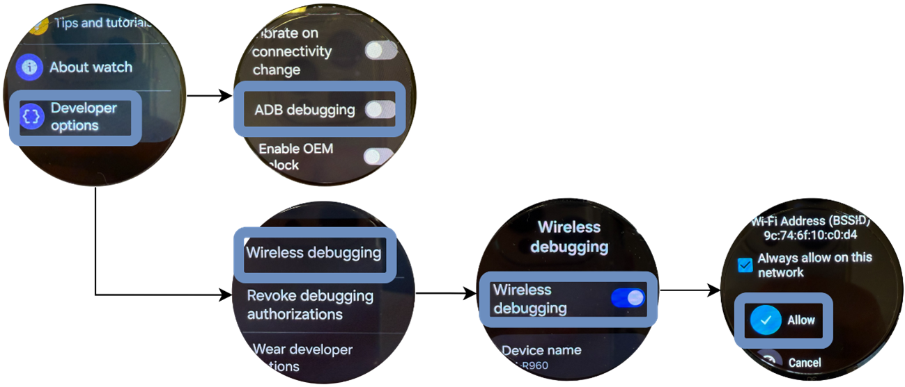
   
  <em>Figure 12. Connecting a Wear OS device to Android Studio</em>

 

In Android Studio, with the project already imported, we access the Device Manager through the third button in the right-side menu. Inside the Device Manager, we click the button displaying a plus symbol with waves, as shown in Figure 13.

  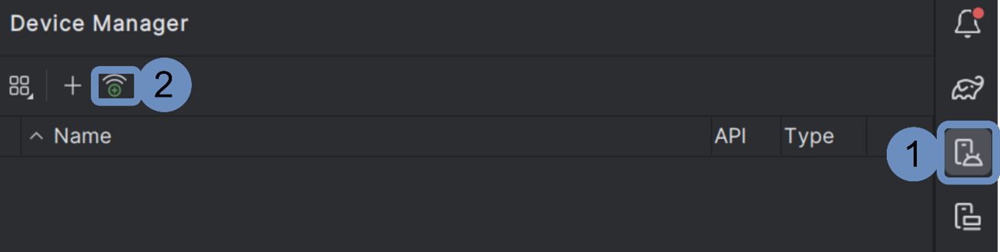
   
  <em>Figure 13. Access to "Pair devices over Wi-Fi" in Android Studio</em>

 

Within the Pair devices over Wi-Fi menu, we select "Pair using pairing code." As shown in Figure 14, the smartwatch should be visible. We click "Pair" and enter the authentication code displayed on the smartwatch screen.

  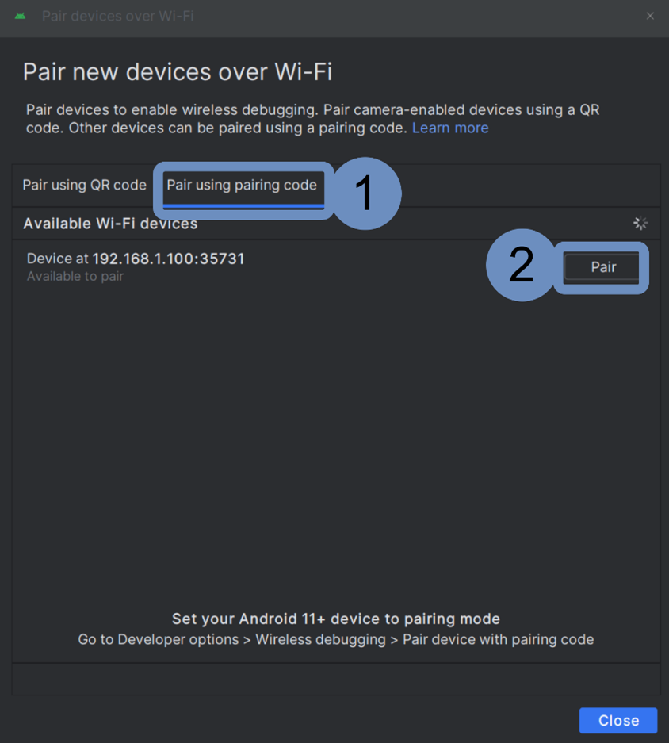
   
  <em>Figure 14. Pairing a new smartwatch in Android Studio</em>

 

Once the device is paired, we close the "Pair devices over Wi-Fi" menu. After pairing the device, it should appear within Device Manager, as shown in Figure 15. In the top menu of Android Studio, we click the green "play" button, which will send the application to the smartwatch. From this moment, the application will be stored on the smartwatch and accessible alongside other applications from the applications inventory.

  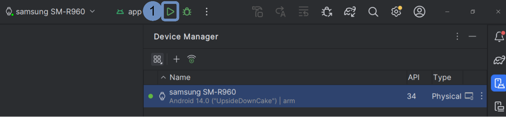
   
  <em>Figure 15. Launching SmartBioStream on a smartwatch</em>

 

### Deploy ServerBioStream

We provide an additional manual on how to deploy [ServerBioStream](ServerBioStream.md). In this section, we summarize the essential features and steps for its deployment. ServerBioStream is a Django web application that receives and stores the data collected from SmartBioStream. We have developed this tool to provide access to the data gathered during the various experiments of a case study. This platform is intended for researchers and administrators rather than the participants of the experiments. Consequently, it provides the following functionalities:

- **JSON API**. This API receives the data emitted by one or multiple smartwatches. The messages are processed, and each measurement is stored in the SQLite database. The API is developed considering the first use case where the end-users are participants of a case study and only provide their experiment identifier.
 
- **User management**. ServerBioStream considers two roles: researchers and administrators. Researchers can connect to the platform and download the stored data. Administrators are the only ones who can create new users. Both of them have to authenticate with a username and password before accessing the web platform.  

- **Data monitoring**. Researchers and administrators can visualize the data received and stored for each experiment. This feature also helps ensure the proper collection of the biometrics during the experiments. It is worth noting that SmartBioStream queues several measurements in the same data transmission, which means that there may be a delay of less than a minute in the data display.

- **Data export**. The users of this platform can download the data collected from each experiment in CSV, XLSX, and PDF formats. This functionality enables the researchers to develop their specific analyses with the necessary software, such as Excel and Python.

The first step to deploy ServerBioStream is to install Python and the required dependencies. We provide a requirements file to facilitate the installation of the Python libraries used by ServerBioStream. Therefore, it is only necessary to run `pip install -r requirements.txt` in the project folder. Once the installation is finished, we can deploy ServerBioStream using the command `python manage.py runserver ip_address:port`. By default, the ip_address should be the IP of the machine where ServerBioStream is running. For the port, we recommend using 8000 for HTTP connections and 8080 for HTTPS.

On Windows, the machine's IP address can be obtained by opening a terminal, running the command `ipconfig`, and looking for the IPv4 address under the active connection (Wi-Fi or Ethernet). Alternatively, it can be found visually in the "Control Panel." On Ubuntu, the IP address can be retrieved by opening a terminal and running `ifconfig`, then checking the IP associated with `eth0 (wired connection)` or `wlan0 (Wi-Fi)`. It can also be found through the "Settings" menu under "Network". On MacOS, the IP address can be obtained by opening a terminal, running `ifconfig`, and looking for the IP under `en0 (Wi-Fi)` or `en1 (Ethernet)`. It is also possible to visualize the IP graphically by going to "System Settings," selecting "Network," and choosing the active connection.

Finally, we can access ServerBioStream through a web browser using the URL `http://ip_address:port`. By default, the login menu will be displayed. The default database includes a user with the username "admin" and password "admin." We strongly recommend changing this password for security reasons.

### Configuration of SmartBioStream

Once ServerBioStream is launched, we need to configure SmartBioStream to connect to it. These settings should be configured by a researcher or administrator, not by the end user. Furthermore, these settings are stored, so they only need to be changed if the ServerBioStream configuration changes.

First, we must identify the IP address and port where ServerBioStream is accessible. By default, the IP corresponds to the server or computer's IP address, and the port is set to 8000. In SmartBioStream, we access the settings menu, as shown in Figure 16. Then, we set the IP and port of the server. The next view asks for the protocol to communicate with the server. By default, ServerBioStream is launched with HTTP, but through NGINX or by providing SSL certificates, it can support HTTPS. If the certificates are self-signed and not provided by a reputable source, we must deactivate CA verification.

Finally, we should select the authentication method. For ServerBioStream, we should select "identifier (ID)" instead of "username and password." To use SmartBioStream with another platform where smartwatch users must authenticate, we need to set the authentication method to "username and password". We can then check the connection with the server through the second button on the home screen. 

  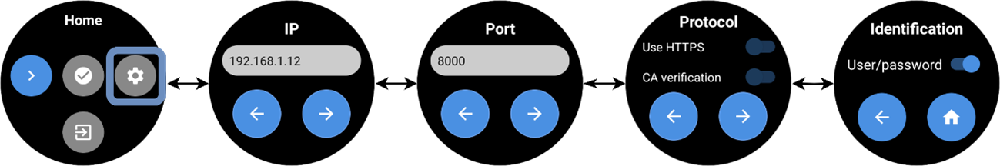
   
  <em>Figure 16. SmartBioStream settings</em>

 

### User manual
To start data collection, we press the first button in the home menu. In the next view, we need to enter the experiment identifier, which must be provided by a researcher. This identifier will be used to group the data in ServerBioStream. If username and password authentication has been selected in the settings, a login view will appear for entering these credentials. The next view corresponds to data collection. By default, data collection is paused and must be started by pressing the green "play" button. From this view, you can return to the main menu or change the sensor selection. Figure 17 shows the data collection views in SmartBioStream.

  
   
  <em>Figure 17. Data collection through SmartBioStream </em>

 

After logging into ServerBioStream, we are redirected to the experiment view (Figure 18). This view displays two tables: the first summarizes all the experiments, and the second shows the collected data for the experiments selected in the first table. We can refresh and export each table using the buttons located at the end of the tables. It is worth noting that SmartBioStream queues several measurements in the same data transmission, which means there may be a delay of less than a minute in the data display. If the user is testing SmartBioStream through an emulator, we adjust the values of the emulated smartwatch sensors using the "Extended Controls" button, as illustrated in Figure 10.

 

  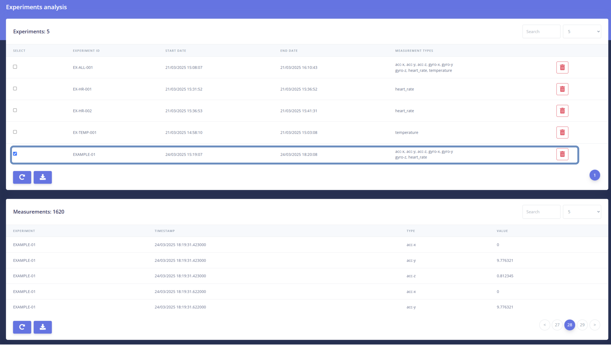
   
  <em>Figure 18. Data analysis through ServerBioStream </em>

 

