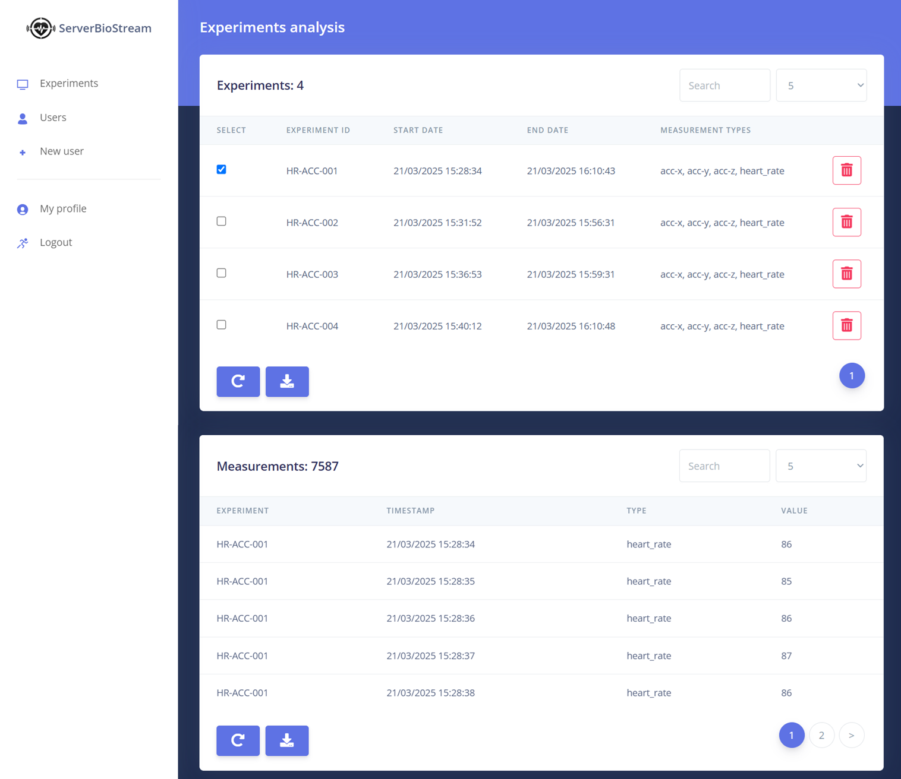
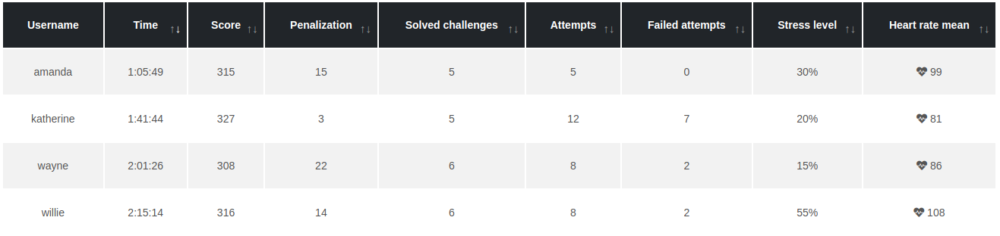

---
BioStream: An open-source solution for biometric data collection through smartwatches

title: 'BioStream: An open-source solution for biometric data collection through smartwatches'

tags:
  - Biometrics
  - Physiological Signals
  - Wear OS
  - Smartwatches
  - Data Collection

authors:
  - name: Mariano Albaladejo-González
    affiliation: 1
    corresponding: true
  - name: Guillermo Vidal-Pina
    affiliation: 1
  - name: Félix Gómez Mármol
    affiliation: 1
  - name: José A. Ruipérez-Valiente
    affiliation: 1

affiliations:
 - name: Universidad de Murcia, Calle Campus Universitario, Murcia, 30100, Murcia, Spain
   index: 1

date: 29 December 2025

bibliography: bibliography.bib
---

# Summary

BioStream is an integrated open-source infrastructure for biometric research through affordable devices, composed of two applications: SmartBioStream and ServerBioStream. SmartBioStream is a Wear OS application that enables the collection of biometric data through user-friendly smartwatches. In addition, we provide a web platform, ServerBioStream, to receive, store, and download the data sent by the smartwatches. The combination of both applications supports conducting biometric studies without the need for expensive research-oriented devices. SmartBioStream can also transmit biometric data to other systems for their analysis, such as educational and workplace platforms. The flexibility, ease of use, and cost-effectiveness of both applications make them valuable tools for democratizing biometric data collection and analysis.

# Statement of need

Biometric data provide valuable insights into individuals' physical and psychological states [@app14156649] [@Zhang2020]. In recent years, we have witnessed significant advancements in sensor technology, improving their precision and reducing their cost and size [@s21103461] [@Stolfi2020]. These improvements have also made it possible to include biometric sensors in commercial and user-oriented devices such as smartwatches [@AlbaladejoGonzalezBook].

Despite the widespread adoption of biometric sensors in user-oriented devices, researchers cannot easily employ them because they do not provide a user-friendly application to collect and send data [@s21103461] [@10584460]. For this reason, researchers without software development skills or available time are forced to acquire expensive and complex research-oriented devices [@Vliaho2022] [@Wei2021]. However, Bachelor's, Master's, and PhD students sometimes cannot afford research-oriented devices such as the Empatica E4 [@Schuurmans2020]. This issue is magnified because some of these devices require purchasing and configuring intermediary devices, such as a mobile phone [@AlbaladejoGonzalezBook]. In addition, using expensive research-oriented devices makes it difficult to conduct long-term case studies with different participants.

# Implementation

BioStream enables the collection and transmission of biometric data from a smartwatch to a server via Wi-Fi. This application supports two different use cases: conducting biometric research and integrating biometric data into other end platforms. In biometric research, the application collects biometrics from the participants in a study and transmits them to a server along with an experiment identifier. We also developed ServerBioStream to receive, store, and export the data sent by the smartwatches. The second use case focuses on integrating SmartBioStream into the main server of an organization. Educational and work institutions can use SmartBioStream to provide biometric data to their software tools. 

## Architecture

SmartBioStream is a Kotlin application developed for Wear OS smartwatches. This application supports both aforementioned use cases by allowing users to select the appropriate configuration from the options menu. ServerBioStream is a Django web platform that integrates an Application Programming Interface (API) to receive and store the data sent by the smartwatches using SmartBioStream. ServerBioStream uses SQLite for accessible data storage and visualization, though it also supports PostgreSQL for better performance in concurrent experiments. Figure 1 illustrates the architecture of both applications. The communication between SmartBioStream and a server is summarized in Figure 2.

## Software functionalities

This subsection describes the main functionalities of both developed applications. The main functionality of SmartBioStream is to collect and transmit biometric data from smartwatches. ServerBioStream is an example of a platform that stores the data emitted by SmartBioStream. In addition to testing and verifying the data transmission, this application is highly valuable for researchers, as it enables them to conduct biometric case studies through Wear OS smartwatches.

### SmartBioStream

This application's user interface was designed to be simple and intuitive, especially the views of the end-users. This application integrates three main functionalities:

* **Options.** This functionality enables users to adjust settings related to communication with the server. The views of this functionality enable the selection of the server's IP address, the port, the protocol (HTTP or HTTPS), whether the application should verify the HTTPS certificate, and the authentication method (username and password or identifier). 

* **Connection test.** This view checks the connectivity between the application and the server. Before starting an experiment, a researcher should verify the server's availability.

* **Data collection.** These views collect and send biometrics from the end-users. Depending on the application settings, this functionality may require an experiment identifier or a username and password. After registration, the users select from the available sensors, including heart rate, accelerometer, gyroscope, and temperature. Then, the users access the recording view, where they can temporarily pause the data collection, return to the sensor menu, or navigate back to the main menu. Figure 3 summarizes the data collection and options views.

### ServerBioStream

This web platform receives and stores the data collected from SmartBioStream. We have developed this tool to provide access to the data gathered during the various experiments of a case study. We define an experiment as the participation of one user in a case study. This platform is intended for researchers and administrators rather than the experiments' participants. Consequently, it supplies the following functionalities:

* **JSON API.** This API receives the data emitted by one or multiple smartwatches. The messages are processed, and each measurement is stored in the database.
* **User management.** ServerBioStream considers two roles: researchers and administrators. Researchers can connect to the platform and download the stored data. Administrators are the only ones who can create new users. Both of them have to authenticate with a username and password before accessing the web platform.
* **Real-time data monitoring.** Researchers and administrators can visualize the data received and stored for each experiment. This feature also helps ensure the proper collection of the biometrics during the experiments.
* **Data export.** The users of this platform can download the data collected from each experiment in CSV, XLSX, and PDF formats. This functionality enables the researchers to develop their specific analyses with the necessary software, such as Excel and Python.

# Use cases

In this section, we provide two use cases utilizing BioStream: one to conduct a biometric study and the other to supply biometric data to an external platform. For both case studies, we used Samsung Galaxy Watch 6 smartwatches. However, any other device with Wear OS operating system and a Wi-Fi module could be used.

## Research setting

We present a biometric case study as an illustrative example of how BioStream supports biometric research. For this case study, researchers collected participants' heart rates and movements (through the accelerometers). One potential application is to evaluate the effect of different stressors or tasks on participants' biometrics. During the case study, researchers can utilize SmartBioStream to monitor each experiment's biometrics in real-time. As Figure 4 shows, ServerBioStream displays two tables: the first summarizes all the experiments, and the second shows the collected data for the experiments selected in the first table. During and after the experiments, researchers can download the collected data in CSV, XLSX, and PDF formats. The downloaded files can then be analyzed using various data analysis software, such as Python or Excel. 

## SmartBioStream to improve cybersecurity training

To illustrate the integration of SmartBioStream with end platforms, we have utilized it with a Cyber Range, an educational platform designed to provide hands-on training for cybersecurity professionals [@AlbaladejoGonzlez2025]. Effective stress management is crucial for these professionals, as they must make rapid, high-stakes decisions during cyber incidents. In the cybersecurity simulations, we measure students' heart rates using Wear OS smartwatches and SmartBioStream. This application sends the heart rates to our Cyber Range, enabling cybersecurity educators to analyze students' heart rates during the simulations. The collected heart rates are displayed in the Cyber Range as another simulation statistic. Figure 5 shows four students' heart rates and stress levels in a cybersecurity simulation.

# Software availability

BioStream is openly available to the research community and the general public through its official repository at [https://github.com/CyberDataLab/BioStream](https://github.com/CyberDataLab/BioStream). 

# Acknowledgment

This work has been partially funded by PID2021-122466OB-I00 and PRE2022-102391 by MCIN/AEI/10.13039/501100011033/FEDER.

# References

